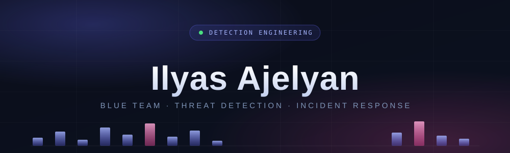

Fourth-year <b>Cybersecurity &amp; Networks</b> engineering student at <b>EMSI Tanger</b>,
focused on defensive security, SOC operations, and detection engineering —
SIEM/SOAR, Sigma-style rules, MITRE ATT&amp;CK, alert triage, log analysis, and
incident response, with a side interest in blockchain security.

---

## 🎯 What I focus on

- **Detection engineering** — SIEM alert logic, Sigma-style rules, MITRE ATT&CK mapping
- **SOC operations** — log analysis, event correlation, threat hunting, alert triage
- **Network security** — IDS/IPS (Suricata, Zeek), traffic analysis, secure architecture
- **Incident response** — triage, playbooks, post-incident analysis

## 🎓 Education

**Cycle Ingénieur — Cybersecurity & Networks** · *EMSI, Tanger* · 2025 – Present
- Core modules: network security, cryptography, intrusion detection, vulnerability analysis, secure system design.
- SEC555-aligned detection engineering: log-pipeline design, SIEM alert creation, and threat-hunting methodology through lab exercises.

**Cycle Ingénieur — Computer Science & Networks** · *EMSI, Tanger* · 2024 – 2025
**Classes Préparatoires (CPGE) — Mathematics & Physics** · *EMSI* · 2021 – 2024
**Baccalauréat — Sciences Mathématiques** · 2019 – 2021

## 💼 Experience

**Cybersecurity Engineering Intern (PFA)** · *Smart Automation Technologies (Growly), Tanger* · 2026
- Designed and deployed **SecureBox**, an inline network-security appliance on Raspberry Pi pairing real-time detection with a **fully offline AI SOC assistant** — end-to-end architecture, backend, and web console.
- Built the detection pipeline: **Suricata** IDS/IPS + **Zeek** telemetry → Fluent Bit → **FastAPI**, with alerts correlated and mapped to **MITRE ATT&CK**.
- Engineered a **SOAR** layer with tiered, human-in-the-loop playbooks and a deterministic action broker executing only signed, reversible, journaled actions (Ed25519-signed catalog, RBAC, hash-chained audit log).
- Implemented a local **RAG assistant** (Qdrant + BGE-M3 + Gemma via Ollama) grounded on 71,000+ security documents (ATT&CK, Sigma, OWASP, NIST, CIS).

**Technical Intern** · *DSI — Amendis (Groupe Veolia), Tanger* · Summer 2025
- Contributed to the technical audit and partial redesign of an internal portal; identified and helped fix critical application bugs, improving stability and service continuity.

## 🚀 Featured projects

My Blue Team work forms a connected toolkit — **Nightjar** raises the alerts,
while **ThreatPulse** and **ioc-enrich** enrich the indicators behind them.

| Project | What it is | Stack |
|---------|-----------|-------|
| **[🛡️ Nightjar](https://github.com/ajelyanilyas/Nightjar)** | Detection-as-Code mini-SIEM: ingests logs, evaluates version-controlled YAML rules, and raises MITRE ATT&CK–mapped alerts on a live dashboard — with a built-in attack replayer. | Python · FastAPI · YAML · MITRE ATT&CK |
| **[📡 ThreatPulse](https://github.com/ajelyanilyas/ThreatPulse)** | A live, self-updating threat-intelligence platform that auto-ingests malware feeds (URLhaus, ThreatFox, Feodo Tracker) hourly and serves a searchable dashboard with on-demand enrichment. | Python · FastAPI |
| **[🔎 ioc-enrich](https://github.com/ajelyanilyas/ioc-enrich)** | IOC enrichment &amp; triage CLI — queries URLhaus, VirusTotal &amp; AbuseIPDB and aggregates a weighted threat verdict for an indicator. | Python |
| **🤖 SecureBox** *(internship)* | Inline network-security appliance on Raspberry Pi pairing real-time detection with a fully offline AI SOC assistant — Suricata/Zeek → FastAPI, alerts mapped to MITRE ATT&CK, plus a signed/reversible SOAR action broker. | Suricata · Zeek · FastAPI · SOAR · RAG |
| **[⛓️ Medichain-plus](https://github.com/ajelyanilyas/Medichain-plus)** | Dual-chain (Hyperledger Fabric + Polygon) healthcare platform with automated parametric micro-insurance and role-based access control. | Solidity · Hyperledger Fabric · Polygon · JavaScript |

Also: a Ransomware Behaviour Simulator (AES-256, isolated VM) and a heuristic Phishing / Malicious-URL detector — academic security projects in Python.

## 🧰 Tech &amp; tools

**Security &amp; SOC**

**Languages**

**Platforms &amp; infra**

## 📜 Certifications &amp; training

- Object-Oriented Programming in **C++** — *EPFL* (Coursera)
- Python for Web Data · Interactivity with JavaScript — *University of Michigan* (Coursera)
- Software Engineering &amp; Project Management — *HKUST* (Coursera)
- Introduction to Machine Learning — *Duke University*
- Introduction to NoSQL Databases — *IBM*

## 📊 GitHub stats

  
  

## 🌍 Languages

**Arabic** — Native &nbsp;·&nbsp; **French** — Fluent &nbsp;·&nbsp; **English** — Professional (technical)

---

Open to cybersecurity internships — threat detection · security monitoring · vulnerability analysis.

